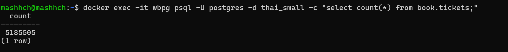

1) Скачала Ubuntu 22.04.5 LTS, установила wsl.
2) Запуск контейнера с pg

```
docker run --name wbpg -p 5432:5432 -e POSTGRES_USER=postgres -e POSTGRES_PASSWORD=postgres -e POSTGRES_DB=wbpgdb -d postgres:latest
```

docker run: Запускаем новый контейнер.
--name wbpg: Задаём имя контейнера как wbpg.
-p 5432:5432: Пробрасываем порт 5432 хоста на порт 5432 внутри контейнера.
-e POSTGRES_USER=postgres: Устанавливаем переменную окружения для контейнера. Задаём имя пользователя PostgreSQL как postgres.
-e POSTGRES_PASSWORD=postgres: Устанавливаем пароль для пользователя postgres в PostgreSQL как postgres.
-e POSTGRES_DB=wbpgdb: Создаём базу данных с именем wbpgdb при запуске контейнера.
-d postgres:latest: Запускаем контейнер в фоновом режиме (-d) и использует последнюю версию образа PostgreSQL (postgres:latest).

2) Скачиваем бд с перевозками

```
docker exec -it wbpg bash -c "apt-get update && apt-get install -y wget tar && wget https://storage.googleapis.com/thaibus/thai_small.tar.gz && tar -xf thai_small.tar.gz && psql -U postgres -d wbpgdb -f thai.sql"
```

docker exec: Позволяет выполнить команду в уже запущенном контейнере.
-it: Запускает контейнер в интерактивном режиме с терминалом (чтобы можно было вводить команды).
wbpg: Имя контейнера, в котором выполняются команды.
bash: Запускает командную оболочку bash внутри контейнера. (bash используется для удобного выполнения нескольких команд внутри контейнера в одной строке)

-c: Запускает команды, переданные в кавычках, в одной строке.
apt-get update: Обновляет список пакетов в контейнере (так как это контейнер на базе Debian/Ubuntu, используется менеджер пакетов apt-get).
apt-get install -y wget tar: Устанавливает необходимые утилиты:
wget: Для загрузки файлов через HTTP/HTTPS.
tar: Для работы с архивами .tar.gz.
Опция -y указывает на автоматическое согласие с установкой без запроса подтверждения.
wget https://storage.googleapis.com/thaibus/thai_small.tar.gz:

Загружает файл thai_small.tar.gz с указанного URL (в данном случае из Google Cloud Storage).
tar -xf thai_small.tar.gz:

Распаковывает файл thai_small.tar.gz в текущем каталоге. Флаг -xf означает "извлечение" (extract) содержимого архива с указанным именем.
psql -U mashhch -d wbpgdb -f thai.sql:

psql: утилита командной строки для взаимодействия с базой данных PostgreSQL.
-U postgres: Указывает пользователя PostgreSQL, от имени которого будет выполнена команда, в данном случае — postgres.
-d wbpgdb: Указывает базу данных, с которой будет работать команда, здесь это wbpgdb.
-f thai.sql: Выполняет SQL-скрипт thai.sql, который был извлечён из архива, в базе данных wbpgdb.

- скрипт создает thai базу данных.

3) Переименуем для удобства бд

```
docker exec -it wbpg psql -U postgres -c "ALTER DATABASE thai RENAME TO thai_small;"
```

4) Проверим количество записей в таблице book.tickets

```
docker exec -it wbpg psql -U postgres -d thai_small -c "select count(*) from book.tickets;"
```

mashhch@mashhch:~$ docker exec -it wbpg psql -U postgres -d thai_small -c "select count(*) from book.tickets;"
count
---------
5185505
(1 row)

