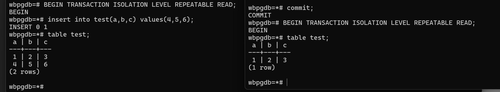

ДЗ Пошаговая инструкция:
1. открыть консоль и зайти по ssh на ВМ
2. открыть вторую консоль и также зайти по ssh на ту же ВМ (можно в докере 2 сеанса)
3. запустить везде psql из под пользователя postgres

подключение к контейнеру докера с 2 консолей:
```
docker exec -it wbpg psql -U postgres -d wbpgdb
```

docker exec -it — запускает команду внутри уже работающего контейнера.

-i — включает режим ввода-вывода, позволяя передавать ввод с клавиатуры в контейнер.
-t — включает терминальный режим (TTY), чтобы сделать командную строку интерактивной.
wbpg — имя контейнера, в котором запущен PostgreSQL.

psql -U postgres -d wbpgdb — это команда, которая запускает клиент psql внутри контейнера:

-U postgres — указывает имя пользователя для подключения.
-d wbpgdb — указывает имя базы данных.

4. сделать в первой сессии новую таблицу и наполнить ее данными

```sql
wbpgdb=# CREATE TABLE test (
                               a INT,
                               b INT,
                               c INT
         );
CREATE TABLE
```
5. посмотреть текущий уровень изоляции:


6. начать новую транзакцию в обеих сессиях с дефолтным (не меняя) уровнем
   изоляции

wbpgdb=# begin;
BEGIN
wbpgdb=*#

7. в первой сессии добавить новую запись

```sql
wbpgdb=*# insert into test(a,b,c) values(1,2,3);
INSERT 0 1
```
8. сделать запрос на выбор всех записей во второй сессии

```sql
 table test;
```
9. видите ли вы новую запись и если да то почему? После задания можете сверить
   правильный ответ с эталонным (будет доступен после 3 лекции)


Воспользуемся правилами видимости https://www.interdb.jp/pg/pgsql05/06.html
По 2 правилу: Мы видим запись в первом окне, потому что xmin = текущей транзакциии(т.к. она добавила запись), транзакция продолжается и xmax = 0 (т.к. запись не обновлялась и не удалялась в течение этой же транзакции), следовательно мы видим запись, которую вставляем в течение самой транзакции. 
По 4 правилу: Мы не видим запись во втором окне, так как транзакция со вставкой не закончилась, и вставка происходит в другой транзакции.

Другими словами, мы работаем со снимком, который содержит в себе только закоммиченные данные. Пока не закончится транзакция, изменения не будут видны, так как грязное чтение в пг недопустимо.
10. завершить транзакцию в первом окне

````
wbpgdb=*# commit;
COMMIT
````
11. сделать запрос на выбор всех записей второй сессии

```sql
wbpgdb=*# table test;
 a | b | c
---+---+---
 1 | 2 | 3
(1 row)
```
12. видите ли вы новую запись и если да то почему?

Да, запись появилась.
По 6 правилу, т.к. транзакция 1 завершилась и t_max = INVALID(т.к. запись не удалялась и не обновлялась).

Другими словами, т.к. уровень изоляции READ COMMITED, то мы видим зафиксированные записи, и есть аномалия фантомного чтения.
13. завершите транзакцию во второй сессии

```sql
wbpgdb=*# commit;
COMMIT
```
14. начать новые транзакции, но уже на уровне repeatable read в ОБЕИХ сессиях

```sql
wbpgdb=# BEGIN TRANSACTION ISOLATION LEVEL REPEATABLE READ;
BEGIN
```
15. в первой сессии добавить новую запись

```sql
wbpgdb=*# insert into test(a,b,c) values(4,5,6);
INSERT 0 1
```
16. сделать запрос на выбор всех записей во второй сессии


17. видите ли вы новую запись и если да то почему?

Мы не видим новую запись во втором окне, так как первая транзакция не зафиксирована, а аномалия грязного чтения в пг отсутсвует.
18. завершить транзакцию в первом окне

```sql
wbpgdb=*# commit;
COMMIT
```
19. сделать запрос во выбор всех записей второй сессии


20. видите ли вы новую запись и если да то почему?
    По правилу 5, так как транзакция, которая зафиксировала значение, являлась активной во время начала выполнения 2 транакции (snapshot = active), то мы не видим запись.
    Другими словами, мы не видим запись во второй транзакции, так как в пг на уровне repeatable read отсутсвует аномалия фантомного чтения.