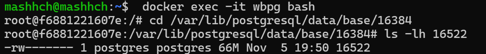
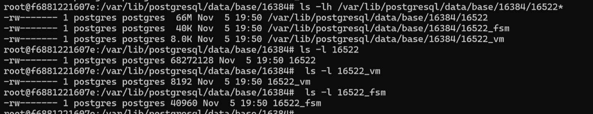

1.Создать таблицу с текстовым полем и заполнить случайными или сгенерированными данным в размере 1 млн строк

```sql

CREATE SCHEMA tests
CREATE TABLE IF NOT EXISTS tests.test_text
(
    id          SERIAL PRIMARY KEY,
    random_text TEXT NOT NULL
);

INSERT INTO tests.test_text (random_text)
SELECT md5(random()::text)
FROM generate_series(1, 1000000);
```

2. Посмотреть размер файла с таблицей

1) через пг
```sql
SELECT
    pg_size_pretty(pg_table_size('tests.test_text')) AS table_data_size, 
    pg_size_pretty(pg_indexes_size('tests.test_text')) AS indexes_size,
    pg_size_pretty(pg_total_relation_size('tests.test_text')) AS total_size;
```

| table_data_size | indexes_size | total_size |
|-----------------|--------------|------------|
| 65 MB           | 21 MB        | 87 MB      |

2) через файловую систему

- первый способ, сначала узнать OID таблицы и OID бд
```sql
SELECT relfilenode ---16522
FROM pg_class
WHERE relname = 'test_text' AND relnamespace = 'tests'::regnamespace;

SELECT oid, datname FROM pg_database WHERE datname = 'wbpgdb'; ---16384
```

- второй способ, сразу узнать путь до файла
```sql
SELECT pg_relation_filepath('tests.test_text'); ---base/16384/16522
```

- путь до пг (путь к основному каталогу данных, где хранятся все файлы, используемые экземпляром PostgreSQ)
```sql
SHOW data_directory; ---/var/lib/postgresql/data
```
'tests'::regnamespace преобразует строку 'tests' в oid схемы с таким именем.
папка base/: Хранит данные всех баз данных в виде подкаталогов, каждый из которых имеет имя, соответствующее oid конкретной базы данных.

подключаемся к докеру:
```mashhch@mashhch:~$  docker exec -it wbpg bash```

переходим в бд:
`root@f6881221607e:/# cd /var/lib/postgresql/data/base/16384`

выводим размер файла бд:
```root@f6881221607e:/var/lib/postgresql/data/base/16384# ls -lh 16522```

-rw------- 1 postgres postgres 66M Nov  5 19:50 16522



Как мы видим результаты не совсем совпадают. попробуем разобраться:



```
root@f6881221607e:/var/lib/postgresql/data/base/16384# ls -lh /var/lib/postgresql/data/base/16384/16522*
-rw------- 1 postgres postgres  66M Nov  5 19:50 /var/lib/postgresql/data/base/16384/16522
-rw------- 1 postgres postgres  40K Nov  5 19:50 /var/lib/postgresql/data/base/16384/16522_fsm
-rw------- 1 postgres postgres 8.0K Nov  5 19:50 /var/lib/postgresql/data/base/16384/16522_vm
root@f6881221607e:/var/lib/postgresql/data/base/16384# ls -l 16522
-rw------- 1 postgres postgres 68272128 Nov  5 19:50 16522
root@f6881221607e:/var/lib/postgresql/data/base/16384#  ls -l 16522_vm
-rw------- 1 postgres postgres 8192 Nov  5 19:50 16522_vm
root@f6881221607e:/var/lib/postgresql/data/base/16384#  ls -l 16522_fsm
-rw------- 1 postgres postgres 40960 Nov  5 19:50 16522_fsm
```

pg_table_size принимает OID или имя таблицы и возвращает объём, который занимает на диске эта таблица без индексов.
(При этом учитывается размер TOAST, карты свободного места и карты видимости.)

```sql
SELECT reltoastrelid
FROM pg_class
WHERE oid = 'tests.test_text'::regclass; --- 16526

SELECT relname FROM pg_class WHERE oid = 16526; ---pg_toast_16522

SELECT pg_relation_filepath('pg_toast.pg_toast_16522'); ---base/16384/16526
```

найдем размер TOAST-таблицы:

```sql
SELECT pg_size_pretty(pg_total_relation_size('pg_toast.pg_toast_16522')) AS toast_table_size; ---8192 bytes
```
Суммируем toast + _vm + _fsm
```
68 272 128+40 960+8 192 + 8192 = 68329472
```

```sql
SELECT pg_table_size('tests.test_text') AS table_data_size; ---68329472
```

Ура, сошлось!

НО

В файловой системе:
```
root@f6881221607e:/var/lib/postgresql/data/base/16384# ls -l 16526
-rw------- 1 postgres postgres 0 Nov  5 19:44 16526
```

Не особо гуглилось, жипити подсказал:

>В PostgreSQL стандартный размер блока данных в таблице — 8 KB. Это означает, что даже пустая TOAST-таблица может занимать один блок данных. 
Файл в файловой системе может быть пустым, потому что в нем нет данных, но PostgreSQL все равно создает структуру для возможного добавления данных в будущем. 
Поэтому файл может быть пустым, но связанные метаданные всё же занимают место в системе. 

3. 5 раз обновить все строчки и добавить к каждой строчке любой символ

```sql
DO
$$
    BEGIN
        FOR i IN 1..5
            LOOP
                UPDATE tests.test_text
                SET random_text = random_text || substr(md5(random()::text), 1, 1);

                RAISE NOTICE 'Итерация % завершена. Время : % ', i, now();
            END LOOP;
    END
$$;
```
```sql
wbpgdb.public> DO
$$
    BEGIN
        FOR i IN 1..5
            LOOP
                UPDATE tests.test_text
                SET random_text = random_text || substr(md5(random()::text), 1, 1);

                RAISE NOTICE 'Итерация % завершена. Время : % ', i, now();
            END LOOP;
    END
$$
Итерация 1 завершена. Время : 2024-11-05 21:12:03.694317+00
Итерация 2 завершена. Время : 2024-11-05 21:12:03.694317+00
Итерация 3 завершена. Время : 2024-11-05 21:12:03.694317+00
Итерация 4 завершена. Время : 2024-11-05 21:12:03.694317+00
Итерация 5 завершена. Время : 2024-11-05 21:12:03.694317+00
[2024-11-06 00:12:24] completed in 20 s 418 ms
```

4. Посмотреть количество мертвых строчек в таблице и когда последний раз приходил
автовакуум

```sql
SELECT
    relname AS table_name,
    n_dead_tup AS dead_row_count,
    last_autovacuum,
    last_autoanalyze,
    NOW() now_time
FROM
    pg_stat_user_tables
WHERE
    relname = 'test_text';  
```

| table_name | dead_row_count | last_autovacuum                   | last_autoanalyze                  | now_time                            |
|------------|----------------|-----------------------------------|-----------------------------------|-------------------------------------|
| test_text  | 5000000        | 2024-11-05 21:01:50.599132 +00:00 | 2024-11-05 21:01:51.352324 +00:00 | 2024-11-05 21:12:25.896915 +00:00   |


5. Подождать некоторое время, проверяя, пришел ли автовакуум

```sql
SELECT
    relname AS table_name,
    n_dead_tup AS dead_row_count,
    last_autovacuum,
    last_autoanalyze,
    NOW() now_time
FROM
    pg_stat_user_tables
WHERE
    relname = 'test_text';  
```

Вакуум почистил:

| table_name | dead_row_count | last_autovacuum                   | last_autoanalyze                  | now_time                           |
|------------|----------------|-----------------------------------|-----------------------------------|------------------------------------|
| test_text  | 0              | 2024-11-05 21:13:08.385867 +00:00 | 2024-11-05 21:13:09.064305 +00:00 | 2024-11-05 21:25:55.011744 +00:00  |

6. 5 раз обновить все строчки и добавить к каждой строчке любой символ

```sql
SELECT pg_size_pretty(pg_table_size('tests.test_text')) AS table_data_size; ---438 MB
```


```sql
DO
$$
    BEGIN
        FOR i IN 1..5
            LOOP
                UPDATE tests.test_text
                SET random_text = random_text || substr(md5(random()::text), 1, 1);

                RAISE NOTICE 'Итерация % завершена. Время : % ', i, now();
            END LOOP;
    END
$$;
```

7. Посмотреть размер файла с таблицей

```
wbpgdb.public> DO
$$
BEGIN
FOR i IN 1..5
LOOP
UPDATE tests.test_text
SET random_text = random_text || substr(md5(random()::text), 1, 1);

                               RAISE NOTICE 'Итерация % завершена. Время : % ', i, now();
                           END LOOP;
                   END
               $$
Итерация 1 завершена. Время : 2024-11-05 21:29:02.799569+00
Итерация 2 завершена. Время : 2024-11-05 21:29:02.799569+00
Итерация 3 завершена. Время : 2024-11-05 21:29:02.799569+00
Итерация 4 завершена. Время : 2024-11-05 21:29:02.799569+00
Итерация 5 завершена. Время : 2024-11-05 21:29:02.799569+00
[2024-11-06 00:29:23] completed in 20 s 988 ms
```

```sql
SELECT pg_size_pretty(pg_table_size('tests.test_text')) AS table_data_size; --- 468 MB
```

```sql
SELECT
    relname AS table_name,
    n_dead_tup AS dead_row_count,
    last_autovacuum,
    last_autoanalyze,
    NOW() now_time
FROM
    pg_stat_user_tables
WHERE
    relname = 'test_text';  
```

| table_name | dead_row_count | last_autovacuum                   | last_autoanalyze                  | now_time                         |
|------------|----------------|-----------------------------------|-----------------------------------|----------------------------------|
| test_text  | 0              | 2024-11-05 21:30:32.557214 +00:00 | 2024-11-05 21:30:33.291089 +00:00 | 2024-11-05 21:30:41.786720 +00:00 |


Автовакуум быстро приходит, т.к. по границе максимума обновленных строк в таблице - 50%, а у нас обновляются все:
```sql
SHOW autovacuum_naptime; --- 1min
SHOW autovacuum_vacuum_threshold; -- 50% -
```

8. Отключить Автовакуум на конкретной таблице

```sql
ALTER TABLE tests.test_text SET (
    autovacuum_enabled = false
);
```

```sql

SELECT relname,
       reloptions
FROM pg_class
WHERE relname = 'test_text' AND relnamespace = 'tests'::regnamespace;
```

| relname    | reloptions                  |
|------------|-----------------------------|
| test_text  | {autovacuum_enabled=false}  |


9. 10 раз обновить все строчки и добавить к каждой строчке любой символ

```sql
DO
$$
    BEGIN
        FOR i IN 1..10
            LOOP
                UPDATE tests.test_text
                SET random_text = random_text || substr(md5(random()::text), 1, 1);

                RAISE NOTICE 'Итерация % завершена. Время : % ', i, now();
            END LOOP;
    END
$$;
```

10. Посмотреть размер файла с таблицей

```sql
SELECT
    relname AS table_name,
    n_dead_tup AS dead_row_count, ---10000000 
    last_autovacuum,
    last_autoanalyze,
    NOW() now_time,
    pg_size_pretty(pg_table_size('tests.test_text')) AS table_data_size --936 MB  
FROM
    pg_stat_user_tables
WHERE
    relname = 'test_text';  

```

| table_name | dead_row_count | last_autovacuum                     | last_autoanalyze                    | now_time                           | table_data_size |
|------------|----------------|-------------------------------------|-------------------------------------|------------------------------------|-----------------|
| test_text  | 10000000       | 2024-11-05 21:30:32.557214 +00:00   | 2024-11-05 21:30:33.291089 +00:00   | 2024-11-05 21:51:03.936218 +00:00  | 936 MB          |


11. Объясните полученный результат

```sql
CREATE EXTENSION pageinspect;
SELECT lp as tuple, t_xmin, t_xmax, t_field3 as t_cid, t_ctid FROM heap_page_items(get_raw_page('tests.test_text',0));


SELECT AVG(pg_column_size(random_text)) + AVG(pg_column_size(id)) AS avg_row_size_in_bytes
FROM tests.test_text AS t; --- 72 байт

```

72 (в среднем запись) * 11 (11 версий строк) * 1 000 000 = 792 000 000 байт = 792 МБ это просто данные 

```sql
SELECT relpages AS page_count ---59929 страниц
FROM pg_class
WHERE relname = 'test_text' AND relnamespace = 'tests'::regnamespace;

```
59929 * 23 = 1 378 367 = 1 Мб метаданные страниц.  
59929* 8192 = 491 Мб - размер страниц. 
> почему это меньше чем 792 Мб, как данные помещаются?....

пытаюсь посмотреть фрагментацию:

```sql

CREATE EXTENSION pgstattuple; 
SELECT * FROM pgstattuple('tests.test_text');
```

| table_len  | tuple_count | tuple_len | tuple_percent | dead_tuple_count | dead_tuple_len | dead_tuple_percent | free_space | free_percent |
|------------|-------------|-----------|---------------|------------------|----------------|--------------------|------------|--------------|
| 980819968  | 1000000     | 86000000  | 8.77          | 0                | 0              | 0                  | 845467668  | 86.2         |


>?? Почему-то показывает 0 мертвых строк, хотя pg_stat говорит о 10млн... 
Я так понимаю разница между реальным размером таблицы 936 Мб, вычисленным путем подсчета строк*размер = 792 Мб, достигается все таки из-за фрагментации? Тостовые страницы не создаются... 
Если не сложно, можете подсказать в обратной связи.

12. Не забудьте включить автовакуум)

```sql
ALTER TABLE tests.test_text SET (
    autovacuum_enabled = true
);
```

| table_name | dead_row_count | last_autovacuum                   | last_autoanalyze                  | now_time                          |
|------------|----------------|-----------------------------------|-----------------------------------|-----------------------------------|
| test_text  | 0              | 2024-11-05 22:29:17.854955 +00:00 | 2024-11-05 22:29:18.677600 +00:00 | 2024-11-05 22:29:38.304962 +00:00 |


Включаем логирование ради интереса
```sql
SHOW config_file; ---/var/lib/postgresql/data/postgresql.conf
root@f6881221607e:/var/lib/postgresql/data/base/16384# nano /var/lib/postgresql/data/postgresql.conf   ----log_autovacuum_min_duration = 0 в коцне файла
^D
docker restart wbpg


SELECT pg_reload_conf();
SHOW log_autovacuum_min_duration; --- 0

```

Логи:
```sql
automatic vacuum of table "wbpgdb.tests.test_text": index scans: 1
2024-11-06 01:49:59     pages: 0 removed, 74075 remain, 74075 scanned (100.00% of total)
2024-11-06 01:49:59     tuples: 5000000 removed, 1000000 remain, 0 are dead but not yet removable
2024-11-06 01:49:59     removable cutoff: 895, which was 0 XIDs old when operation ended
2024-11-06 01:49:59     new relfrozenxid: 894, which is 3 XIDs ahead of previous value
2024-11-06 01:49:59     frozen: 0 pages from table (0.00% of total) had 0 tuples frozen
2024-11-06 01:49:59     index scan needed: 61729 pages from table (83.33% of total) had 4999974 dead item identifiers removed
2024-11-06 01:49:59     index "test_text_pkey": pages: 16452 in total, 0 newly deleted, 0 currently deleted, 0 reusable
2024-11-06 01:49:59     avg read rate: 25.284 MB/s, avg write rate: 27.848 MB/s
2024-11-06 01:49:59     buffer usage: 100177 hits, 126220 misses, 139022 dirtied
2024-11-06 01:49:59     WAL usage: 213928 records, 63263 full page images, 55720317 bytes
2024-11-06 01:49:59     system usage: CPU: user: 1.77 s, system: 1.37 s, elapsed: 39.00 s
2024-11-06 01:50:00 2024-11-05 22:50:00.771 UTC [38] LOG:  automatic analyze of table "wbpgdb.tests.test_text"
2024-11-06 01:50:00     avg read rate: 230.771 MB/s, avg write rate: 0.056 MB/s
2024-11-06 01:50:00     buffer usage: 5387 hits, 24842 misses, 6 dirtied
2024-11-06 01:50:00     system usage: CPU: user: 0.16 s, system: 0.09 s, elapsed: 0.84 s
```

Задание со *:
Написать анонимную процедуру, в которой в цикле 10 раз обновятся все строчки в искомой таблице.
Не забыть вывести номер шага цикла.

```sql
DO
$$
    BEGIN
        FOR i IN 1..10
            LOOP
                UPDATE tests.test_text
                SET random_text = random_text || substr(md5(random()::text), 1, 1);

                RAISE NOTICE 'Итерация % завершена. Время : % ', i, now();
            END LOOP;
    END
$$;
```