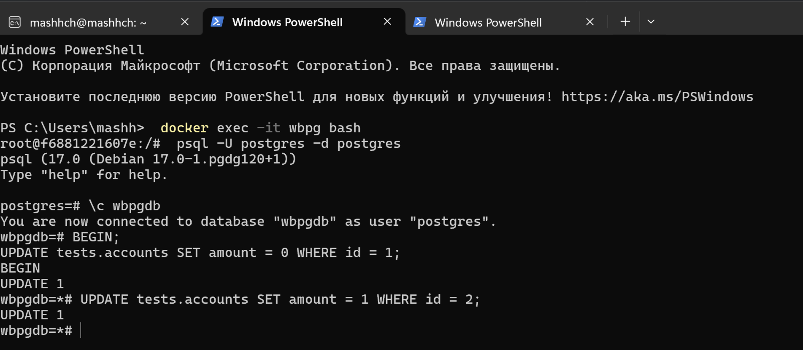
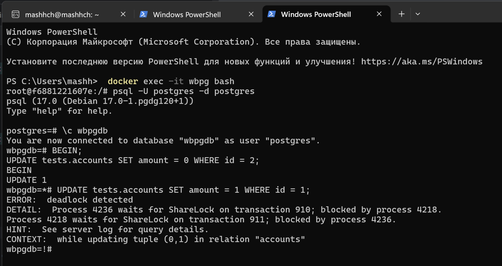
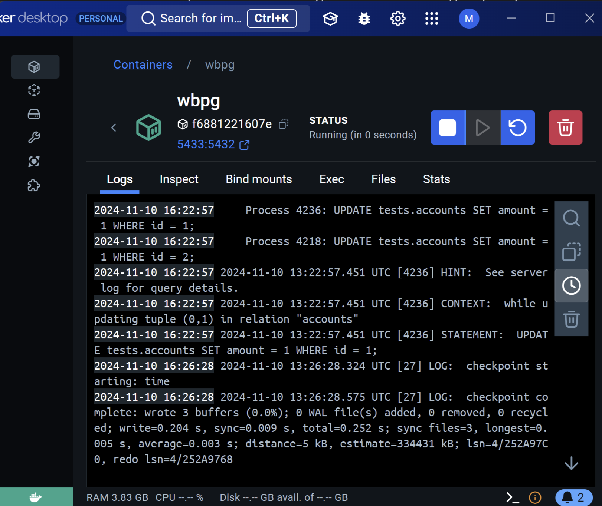

ДЗ-4:
0. Подключаемся к докеру

```
docker exec -it wbpg bash - подключение к контейнеру

psql -U postgres -d postgres - подключение к базе пг

\c wbpgdb - переключаемся на другую бд
```


1. Создать таблицу accounts(id integer, amount numeric);

```sql
 CREATE TABLE tests.accounts (
    id INT PRIMARY KEY,
    amount NUMERIC
);

INSERT INTO tests.accounts (id, amount)
SELECT
    generate_series(1, 100) AS id,
    round((random() * 1000)::numeric, 2) AS amount;
```
2. Добавить несколько записей и подключившись через 2 терминала добиться ситуации взаимоблокировки (deadlock).

1 терминал:

```sql
BEGIN;
UPDATE tests.accounts SET amount = 0 WHERE id = 1;
```

2 терминал:

```sql
BEGIN;
UPDATE tests.accounts SET amount = 0 WHERE id = 2;
```

1 терминал:

```sql
UPDATE tests.accounts SET amount = 1 WHERE id = 2;
```

2 терминал:

```sql
UPDATE tests.accounts SET amount = 1 WHERE id = 1;
```
1 консоль:



2 консоль:




3. Посмотреть логи и убедиться, что информация о дедлоке туда попала.



```sql
2024-11-10 16:22:57 2024-11-10 13:22:57.451 UTC [4236] ERROR:  deadlock detected
2024-11-10 16:22:57 2024-11-10 13:22:57.451 UTC [4236] DETAIL:  Process 4236 waits for ShareLock on transaction 910; blocked by process 4218.
2024-11-10 16:22:57     Process 4218 waits for ShareLock on transaction 911; blocked by process 4236.
2024-11-10 16:22:57     Process 4236: UPDATE tests.accounts SET amount = 1 WHERE id = 1;
2024-11-10 16:22:57     Process 4218: UPDATE tests.accounts SET amount = 1 WHERE id = 2;
2024-11-10 16:22:57 2024-11-10 13:22:57.451 UTC [4236] HINT:  See server log for query details.
2024-11-10 16:22:57 2024-11-10 13:22:57.451 UTC [4236] CONTEXT:  while updating tuple (0,1) in relation "accounts"
2024-11-10 16:22:57 2024-11-10 13:22:57.451 UTC [4236] STATEMENT:  UPDATE tests.accounts SET amount = 1 WHERE id = 1;
```